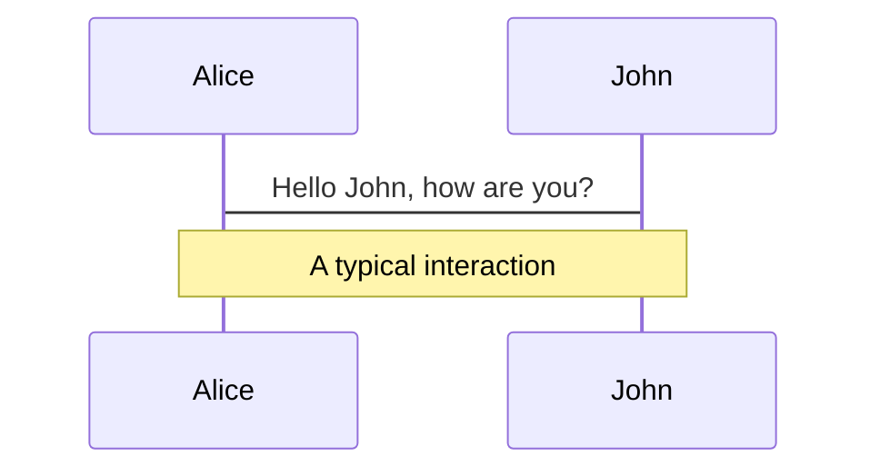
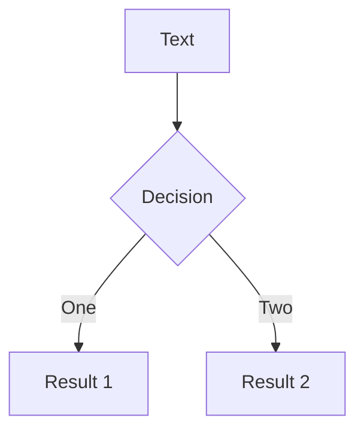
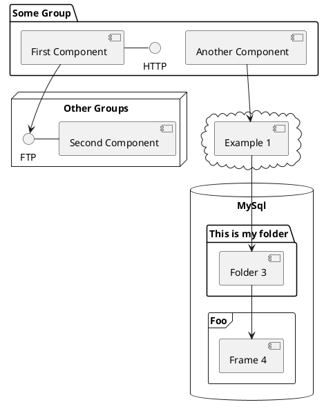

# CSS-in-React & Atomic CSS

Presentation slides for developers

<div class="pt-12">
  <span @click="$slidev.nav.next" class="px-2 py-1 rounded cursor-pointer" hover="bg-white bg-opacity-10">
    Press Space for next page <carbon:arrow-right class="inline"/>
  </span>
</div>

<div class="abs-br m-6 flex gap-2">
  <button @click="$slidev.nav.openInEditor()" title="Open in Editor" class="text-xl icon-btn opacity-50 !border-none !hover:text-white">
    <carbon:edit />
  </button>
  <a href="https://github.com/slidevjs/slidev" target="_blank" alt="GitHub"
    class="text-xl icon-btn opacity-50 !border-none !hover:text-white">
    <carbon-logo-github />
  </a>
</div>

<!--
The last comment block of each slide will be treated as slide notes. It will be visible and editable in Presenter Mode along with the slide. [Read more in the docs](https://sli.dev/guide/syntax.html#notes)
-->

---

# 主流框架如何处理 CSS

## VUE

通过 `scoped style`标签， 将样式标签直接内置到 `VUE` 单个文件中，也有外部引入的方案

## Angular

内置的组件样式

---

# React

并没有提供原生的 CSS 封装方案，可以通过 <kbd>className</kbd>或者 <kbd>css</kbd> 对象的方式处理样式

```jsx
/* JSX */
<div className="name">React</div>

/* CSS */
.name {
	color: red;
}
```

```jsx
const style = {
	color: red;
}

<div style={style}>React</div>
```

<br>
<br>

<style>
h1 {
  background-color: #2B90B6;
  background-image: linear-gradient(45deg, #4EC5D4 10%, #146b8c 20%);
  background-size: 100%;
  -webkit-background-clip: text;
  -moz-background-clip: text;
  -webkit-text-fill-color: transparent;
  -moz-text-fill-color: transparent;
}
</style>

---

# 传统的 CSS 存在什么问题

* 繁琐的选择器命名，样式生效顺序依赖于加载顺序

* 全局作用域，易发生样式冲突和覆盖

* 死代码消除

<p v-click class="opacity-80 transform font-serif">
  <p class="text-sm">CSS 的缺点一直很明显，在开发功能时，需要绞尽脑汁想类名来解决全局命名冲突问题，并且一不小心就会造成样式冲突或者覆盖。</p>
  <p class="text-sm">而且在大型项目不断的迭代中，重复的CSS 代码会越来越多，CSS 基本上会一直增大，因为大多数时候，我们只会关心功能的实现。</p>
  <p class="text-sm">在进行功能迭代时，很少会留意对应的 CSS 代码，例如我们删除某行 HTML，但是对应的 CSS 很有可能不会删除，因为我们不知道这段 CSS 代码有没有被其他地方使用，不敢贸然删除。</p>
  <p class="text-sm">项目开发中经常遇到，修改了一个功能和其对应的样式，却没注意到影响到了其他地方，导致出现线上问题</p>
</p>

<!--
随着 React、VUE 等组件化框架的发展和流行，CSS 的处理方式逐渐向着组件化的方向去发展、并且围绕着几个 CSS 存在的问题发展出各种各样的 CSS 解决方案：
  - 减少选择器命名和样式的冲突（全局作用域、生效顺序依赖于样式加载顺序）
  - 清晰的 CSS 整体结构
  - 去除冗余代码、减少CSS样式的体积（死代码移除）
  - 可重复利用、组件化的 CSS（与 JS常量共享）
  - 提高 CSS 代码的可读性
-->

---

# React 的几种 CSS 方案

预处理器 & CSS-Modules

配合 Less、Sass预处理器，通过构建工具，将 class 的名字或者选择器的名字作用域化，解决全名命名冲突

```ts
/* CSS */
.name {
	color: red;
}

/* JSX */
import styles from '*.css';

<div className={style.name}>React</div>

/* 输出 */
<div class="home__header-nav__name___b17c8">React</div>
```

---

# 优点&缺点

## 优点
- 有效避免全局污染和样式冲突(webpack进行打包时，将所有js文件导入到入口App.js文件中，样式也会统一加载到入口中，根据css的layout规则，后面的样式会覆盖掉前面的样式声明，造成全局样式的覆盖问题)
- 解决嵌套层次过深的问题

## 缺点

- 依然需要想类名，但是不用再担心命名冲突问题
- 无法解决 CSS 代码越来越大的问题
- 与 JS 无法很好的常量共享，组件化不够完善

<!--
  Sass和Less都属于CSS预处理器,CSS 预处理器定义了一种新的语言，其基本思想是，用一种专门的编程语言，为 CSS 增加了一些编程的特性，将 CSS 作为目标生成文件，然后开发者就只要使用这种语言进行CSS的编码工作。转化成通俗易懂的话来说就是“用一种专门的编程语言，进行 Web 页面样式设计，再通过编译器转化为正常的 CSS 文件”。

  目前美间主站这边的方案一直是 less + css-modules+BEM 规范的形式运行，并且使用 babel 插件将 clssName 替换为 styleName 使用（这样可以不用引入 css 对象，直接按照 className的写法使用即可）。
-->

---
---

# 美间主站使用方式
Less | CSS-Modules | BEM

<div grid="~ cols-2 gap-2" m="-t-2">

```tsx
  JSX
```

```tsx
  CSS
```


</div>

---

# CSS-in-JS
<p>css-in-js 是近几年提出的一种技术方案，并不是一个具体的框架或者库.</p>

<p v-click>简单来说 css-in-js 就是将 CSS 样式写到 JavaScript 文件里面，而不是单独的.css、.less 或者.scss 文件,去处理一些原生 CSS 写法存在的问题.</p>
<p v-click>这样就可以在CSS中使用一些属于JS的诸如模块声明，变量定义，函数调用和条件判断等语言特性来提供灵活的可扩展的样式定义。</p>
<p v-click>14 年开始，CSS-in-JS 的解决方案井喷式发展，各种框架和库层出不穷，我们这次先找两个社区使用较多的来看下</p>

<v-clicks>

### 优点

- 组件化的模式，不再需要维护一堆样式文件，契合 React 的组件化思想
- 利用 JS 环境的所有功能来增强 CSS（常量、条件判断等...）
- 真正的选择器隔离，杜绝样式污染
- 动态变化的主题和变量
- 被动的消除未使用的代码

</v-clicks>

---

# Styled-Components

CSS-in-JS的一种解决方案，也是目前社区使用较多的方案之一。使用 JS 来样式化组件，解析 JS 时，生成 CSS 并将其附加在 DOM 中，它允许使用 JS 已声明性和可维护性的方式描述样式，从而将 CSS 抽象到组件级别本身

[在线演示](https://stackblitz.com/edit/react-ts-mc2kne?file=components%2FDesignBox.tsx)


---

# Styled-Components 优缺点

<v-clicks>

优点：

* 使用成本低，复用性强，不依赖一大堆的工具链
* 可以在服务端使用，支持 `SSR`
* 适合于组件库开发，使用直接引用 `import module` 即可，不然在使用组件时还需要引入单独的样式文件

</v-clicks>

<v-clicks>

缺点：

- 缺乏扩展性
- CSS 无法很好的利用浏览器缓存，样式都是由 JS 动态生成的
- 如果没有好的组件抽离方案的话，单个文件会很长

</v-clicks>

---

# Styled-System

另外 Styled-Components 还可以配置 styled-system 使用

```tsx
import styled from 'styled-components'
import {
  space,
  width,
  maxWidth,
  flex,
  color
} from 'styled-system'

const Button = styled.div`
  ${space}
  ${width}
  ${maxWidth}
  ${flex}
  ${color}
`

<Button color='red'>StyleSystem</Button>
```

---

# Styled-jsx
React 的另一种 CSS-in-JS 的方案，使 React 像 VUE 那样处理样式[GitHub](https://github.com/vercel/styled-jsx)

```tsx {all|6}
<div>
  <div class="chat-notification">
    <div class="chat-notification-logo-wrapper" />
    <p class="chat-notification-message">You have a new message!</p>
  </div>
  <style jsx>
  {`
    .chat-notification {
      display: flex;
      max-width: 24rem;
      border-radius: 0.5rem;
    }
    .chat-notification-logo-wrapper {
      flex-shrink: 0;
    }
    .chat-notification-message {
      color: #718096;
      line-height: 1.5;
    }
  `}
</style>
</div>
```

---

# Atomic CSS
Atomic CSS（原子 CSS）在很久以前就出现了，通过抽离一组更小单元的类，每个类都对应着一个唯一的 CSS 规则，减少手写重复的 CSS，复用类。

<div grid="~ cols-2 gap-2" m="-t-2">

```tsx
  JSX
```

```tsx
  CSS
```


</div>

---

# Atomic CSS

<p>不同于我们之前使用的 BEM 规范，原子化 CSS 就是拆分，每一个类都对应着一个唯一的 CSS 规则，本质上其实就是组件化 CSS 的一种极致的使用方式而已。</p>
<p>这种方案很早之前就出现了，比如之前的`bootstrap` ，做为一个 UI 库，附带着一部分 CSS 工具，这部分 CSS 工具其实就是原子 CSS，只不过比我们今天所说的原子化 CSS 有所不同，`Tailwind` 的颗粒度更小，是 `bootstrap` 的加强版，`bootstrap` 是提前写好了一套样式让你去使用</p>
<p>传统的原子 CSS 存在一系列问题，需要靠团队内部进行维护，但是难以维护，且成本过高，并且团队还会受到<a href="https://baike.baidu.com/item/%E5%B7%B4%E5%A3%AB%E5%9B%A0%E5%AD%90/5350852?fr=aladdin">巴士因子</a>的影响。</p>
<p>随着前端组件化的发展，原子 CSS 一直处于不温不火的状态，直到 `CSS-in-JS`概念的兴起，`TailWindCSS` 扛起了原子 CSS 的大旗</p>

---

# TailWindCSS

NPM 下载量


[2021CSS使用报告](https://2021.stateofcss.com/zh-Hans/)

---

# TailWindCSS介绍

`TailWindCSS` 并不就是代表原子 `CSS` 的概念，原子 CSS 我们之前说过，这种概念很早之前就有了。TailWindCSS 将其发扬光大而已，它只是原子 `CSS` 的一个解决方案，让我们不再手写原子 `CSS`

`TailWindCSS` 通过 Utility-First (工具优先) 的理念来解决 CSS 的缺点，通过抽象出一组类名 → 原子功能的结合，来避免为每个 div 写一个专有的 class

> 工具优先：从一组受约束的基本实用程序构建复杂的组件。

`TailWindCSS` 提供了一套公共的命名规范，通过这套规范进行配置，可以为我们的网站生成一套专属的工具 CSS。它默认提供了一些基础的值，这些基础的配置已经能够覆盖我们绝大部分的需求，如果有不能满足需求的地方，可以通过配置文件，来扩展或者修改默认值。

---

# TailWindCSS示例

<div grid="~ cols-2 gap-2" m="-t-2">


</div>

---

# TailWindCSS示例
通过 TailWindCSS，我们将之前的 class 替换成了 TailWindCSS 提供的一系列工具类


---

# TailWindCSS特性

处理悬停、焦点和其他状态


<v-clicks>

除此之外，还支持其他的状态操作：

- 伪类: `hover`，`focus`，**`first-child` ...**
- 伪元素: **`before`、`after`、`placeholder`、`selection`**
- 媒体查询：如响应断点、深色模式等
- 属性选择器：**`[dir="rtl"]`、`[open]`**

</v-clicks>

---

# TailWindCSS特性
处理悬停、焦点和其他状态

与传统 CSS 相比。

传统上，相同的类名在悬停时应用不同的样式

```css
.btn {
	color: red;
}

/* 悬停时 */
.btn:hover {
	color: blue;
}
```

TailWindCSS, 对默认状态和悬停状态使用不同的类

```css
.bg-sky-500 {
  background-color: #0ea5e9;
}
.hover\:bg-sky-700:hover {
  background-color: #0369a1;
}
```

---

# TailWindCSS特性
响应式设计

在 `TailWindCSS`中，进行响应式设计非常简单，它内部提供了默认的断点类，如果想让某个样式在某个断点时生效，只需要在该样式类前加上断点类即可。
并且断点类适用于 `TailWindCSS`中所有的样式类，例如颜色、字体大小、布局方式等


---

# TailWindCSS 特性
响应式设计

TailWindCSS由于提供了内置断点类的值，如果不满足我们的需求，我们还可以很轻松的定制自己的断点类, 只需要在tailwind.config.js 添加配置即可


---

# TailWindCSS 特性
深色模式

TailWindCSS 默认支持深色模式配置，并且使用非常简单,只需要给样式类加上 dark 前缀，就代表这这个样式会在深色模式下生效，TailWindCSS会默认识别浏览器是否处于深色模式下，是的话会自动替换主题为深色模式


[在线示例](https://stackblitz.com/edit/react-ts-jaok4w?file=index.tsx)

---

# TailWindCSS 特性
深色模式

同样，TailWindCSS除了支持自动模式切换，也支持手动切换深色模式，只需要添加配置，并通过 JS 控制html 标签的类即可即可。


---

# TailWindCSS 特性
自定义样式

TailWindCSS 为我们提供了丰富的样式类，已基本覆盖了我们的需求，但是实际开发中难免会有一些需要定制的东西，这时我们就可以很简单的利用 TailWindCSS 配置文件来定制我们的需求

自定义主题


---

# TailWindCSS 特性
自定义样式

使用任意值


---

# TailWindCSS 特性
自定义样式

使用组件类


---

# TailWindCSS 特性
函数和指令

TailWindCSS提供了一些供我们使用的函数和指令，可以让我们为 TailWindCSS 提供特殊的功能

- **`@tailwind`  将 `TailWindCSS` 的样式插入到 `CSS` 中，例如`reset.css`(base)**
- **`@layer` 告诉 `TailWindCSS` 我们的自定义样式属于哪一个模块：`base`、`components`、`utilities`**
- **`@apply` 创建自定义的样式类**
- `theme()` 访问 `TailWindCSS` 的主题配置
- `screen()` 访问`TailWindCSS` 的响应式断点值（包括自定义断点）


---

# TailWindCSS 特性
函数和指令

使用@apply  定制类


---

# TailWindCSS 优缺点

TailWindCSS 的优点

- 提高开发效率，不需要离开 HTML 即可完成页面
- 减少了选择器命名和样式冲突
- 兼容各大框架，CSS-in-JS 的模式，搭配 React 等组件化框架，复用性和可移植性大大增强
- 便于去除死代码，CSS 会根据 HTML 的移除而移除
- 大大减少了 CSS 的体积，全局只需要依赖 TailWindCSS 即可完成功能
- 丰富的预设，预设字体大小，丰富的颜色
- 方便扩展，根据你的项目需要，自定义相关的原子类

TailWindCSS 的缺点

- HTML 不够美观
- 必须要有一套完善的 UI 设计规范。如果 UI 出图很随意，我们又不得不为了适配而添加自定义样式，会违背 TailWindCSS 的初衷
- 前期有一定的上手成本，后期维护有可能会存在一定问题
---
layout: image-right
image: https://source.unsplash.com/collection/94734566/1920x1080
---

# Code

Use code snippets and get the highlighting directly![^1]

```ts {all|2|1-6|9|all}
interface User {
  id: number
  firstName: string
  lastName: string
  role: string
}

function updateUser(id: number, update: User) {
  const user = getUser(id)
  const newUser = {...user, ...update}  
  saveUser(id, newUser)
}
```

<arrow v-click="3" x1="400" y1="420" x2="230" y2="330" color="#564" width="3" arrowSize="1" />

[^1]: [Learn More](https://sli.dev/guide/syntax.html#line-highlighting)

<style>
.footnotes-sep {
  @apply mt-20 opacity-10;
}
.footnotes {
  @apply text-sm opacity-75;
}
.footnote-backref {
  display: none;
}
</style>

---

# Components

<div grid="~ cols-2 gap-4">
<div>

You can use Vue components directly inside your slides.

We have provided a few built-in components like `<Tweet/>` and `<Youtube/>` that you can use directly. And adding your custom components is also super easy.

```html
<Counter :count="10" />
```

<!-- ./components/Counter.vue -->
<Counter :count="10" m="t-4" />

Check out [the guides](https://sli.dev/builtin/components.html) for more.

</div>
<div>

```html
<Tweet id="1390115482657726468" />
```

<Tweet id="1390115482657726468" scale="0.65" />

</div>
</div>


---
class: px-20
---

# Themes

Slidev comes with powerful theming support. Themes can provide styles, layouts, components, or even configurations for tools. Switching between themes by just **one edit** in your frontmatter:

<div grid="~ cols-2 gap-2" m="-t-2">

```yaml
---
theme: default
---
```

```yaml
---
theme: seriph
---
```


</div>

Read more about [How to use a theme](https://sli.dev/themes/use.html) and
check out the [Awesome Themes Gallery](https://sli.dev/themes/gallery.html).

---
preload: false
---

# Animations

Animations are powered by [@vueuse/motion](https://motion.vueuse.org/).

```html
<div
  v-motion
  :initial="{ x: -80 }"
  :enter="{ x: 0 }">
  Slidev
</div>
```

<div class="w-60 relative mt-6">
  <div class="relative w-40 h-40">
    
    
    
  </div>

  <div
    class="text-5xl absolute top-14 left-40 text-[#2B90B6] -z-1"
    v-motion
    :initial="{ x: -80, opacity: 0}"
    :enter="{ x: 0, opacity: 1, transition: { delay: 2000, duration: 1000 } }">
    Slidev
  </div>
</div>

<!-- vue script setup scripts can be directly used in markdown, and will only affects current page -->
<script setup lang="ts">
const final = {
  x: 0,
  y: 0,
  rotate: 0,
  scale: 1,
  transition: {
    type: 'spring',
    damping: 10,
    stiffness: 20,
    mass: 2
  }
}
</script>

<div
  v-motion
  :initial="{ x:35, y: 40, opacity: 0}"
  :enter="{ y: 0, opacity: 1, transition: { delay: 3500 } }">

[Learn More](https://sli.dev/guide/animations.html#motion)

</div>

---

# LaTeX

LaTeX is supported out-of-box powered by [KaTeX](https://katex.org/).

<br>

Inline $\sqrt{3x-1}+(1+x)^2$

Block
$$
\begin{array}{c}

\nabla \times \vec{\mathbf{B}} -\, \frac1c\, \frac{\partial\vec{\mathbf{E}}}{\partial t} &
= \frac{4\pi}{c}\vec{\mathbf{j}}    \nabla \cdot \vec{\mathbf{E}} & = 4 \pi \rho \\

\nabla \times \vec{\mathbf{E}}\, +\, \frac1c\, \frac{\partial\vec{\mathbf{B}}}{\partial t} & = \vec{\mathbf{0}} \\

\nabla \cdot \vec{\mathbf{B}} & = 0

\end{array}
$$

<br>

[Learn more](https://sli.dev/guide/syntax#latex)

---

# Diagrams

You can create diagrams / graphs from textual descriptions, directly in your Markdown.

<div class="grid grid-cols-3 gap-10 pt-4 -mb-6">







</div>

[Learn More](https://sli.dev/guide/syntax.html#diagrams)


---
layout: center
class: text-center
---

# Learn More

[Documentations](https://sli.dev) · [GitHub](https://github.com/slidevjs/slidev) · [Showcases](https://sli.dev/showcases.html)
